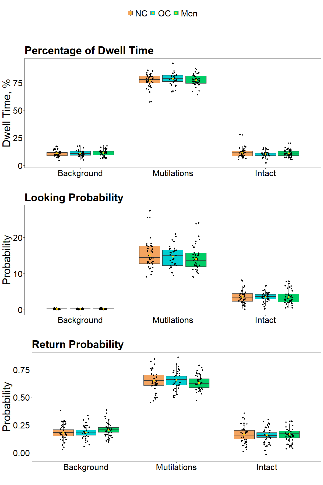
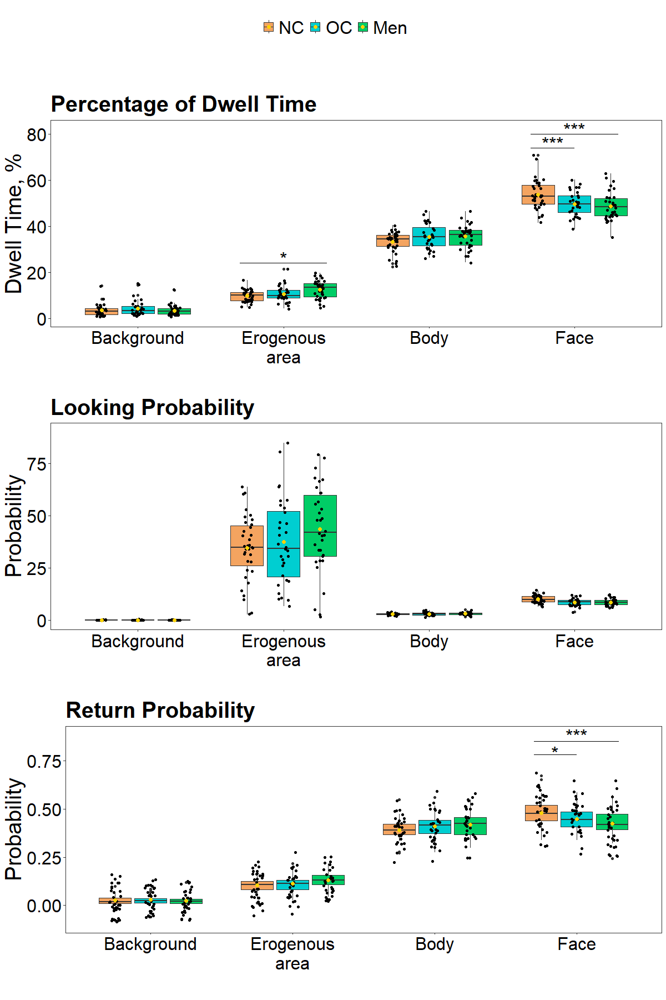
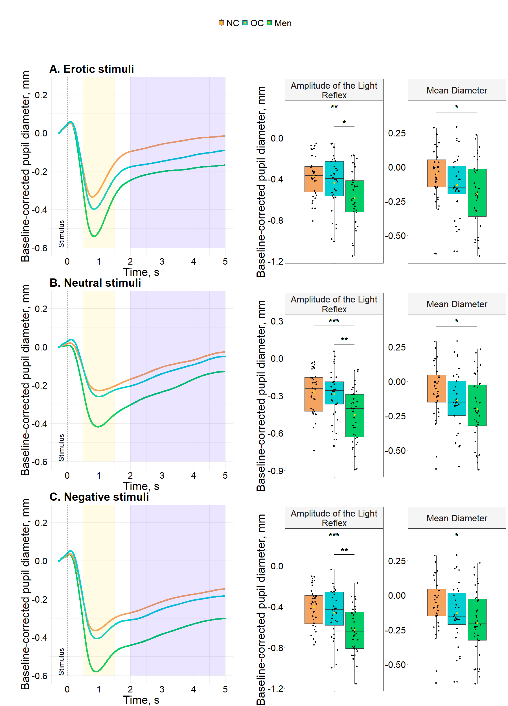

# Eye_tracking_figures
Zelionkaite

# Libraries

``` r
library(ggplot2)
library(extrafont)
library(gridExtra)
library(cowplot)

load("Figure_data.RData")
```

# Legend

``` r
legendai_top <- ggplot(Figure_gaze_erotic, aes(x=AOI2, y=dwell_time, fill=factor(Group2, levels = c('NC', 'OC', 'Men'))))+
    geom_boxplot() +
    geom_jitter(position = position_jitterdodge(jitter.width = 0.2, seed = 123)) +
    theme_minimal() +
    labs(x = '', y = 'Percentage, %', title = 'Dwell Time') +
    theme(plot.title = element_text(hjust = 0, vjust=1, size = 30, face = 'bold', color = 'black'),
          text = element_text(size = 30, color = 'black'))+
      scale_fill_manual('', values = c('NC' = 'sandybrown', 'OC' = 'darkturquoise', 'Men' = 'springgreen3')) +
  theme(legend.position="top", legend.margin = margin(t = -50, r = 0, b = 0, l = 0))+
     scale_x_discrete(labels = function(x) stringr::str_wrap(x, width = 0.01), 
                     limits = c("Background", "Erogenous area", "Body", "Face"))+
 stat_summary(fun = mean, geom = "point", shape = 16, size = 2, color = "#fcd303", position = position_dodge(width = 0.75))


shared_legend200 <- get_legend(legendai_top)
```

# Gaze

## Neutral

### Inidivual

``` r
dwell_time_neut <- ggplot(Figure_gaze_neutral) +
    aes(x = AOI2, y = dwell_time, fill = reorder(Group2, as.numeric(factor(Group2, levels = c("NC", "OC", "Men"))))) +
    geom_boxplot() +
    geom_jitter(position = position_jitterdodge(jitter.width = 0.2, seed = 123, jitter.height = 0.2)) +
    scale_fill_hue(direction = 1) +
    theme_test() +
    labs(x = '', y = 'Dwell Time, %', title = 'Percentage of Dwell Time') +
   theme(plot.title = element_text(hjust = 0, vjust=1, size = 30, face = 'bold', family = 'Times New Roman', color = 'black'),
          text = element_text(size = 30, family = 'Times New Roman', color = 'black'),
          axis.text.x = element_text(angle = 0, family = 'Times New Roman', color = 'black'),
          axis.text.y = element_text(family = 'Times New Roman', color = 'black'))+
  theme(legend.position="top", legend.margin = margin(t = 0, r = 0, b = 0, l = 0))+
    scale_fill_manual('', values = c("NC" = "sandybrown", "OC" = "darkturquoise", "Men" = "springgreen3")) + 
    scale_x_discrete(labels = function(x) stringr::str_wrap(x, width = 0.01), limits = c("Background", "Body", "Face")) +
   guides(fill = FALSE)+
  scale_x_discrete(labels = function(x) stringr::str_wrap(x, width = 0.01), 
                     limits = c("Background", "Body", "Face"))+
    annotate("text", x = 2.85, y = 67, label = "*", size = 9, color = "black")+ 
    geom_segment(aes(x = 2.7, xend = 3, y = 65, yend = 65), color = "black", size = 0.5)+
    annotate("text", x = 3, y = 73, label = "**", size = 9, color = "black")+ 
    geom_segment(aes(x = 2.7, xend = 3.3, y = 71, yend =71), color = "black", size = 0.5)+
 stat_summary(fun = mean, geom = "point", shape = 16, size = 2, color = "#fcd303", position = position_dodge(width = 0.75))
```


``` r
looking_prob_neutral <- ggplot(Figure_gaze_neutral) +
    aes(x = AOI2, y = looking_prob, fill = reorder(Group2, as.numeric(factor(Group2, levels = c("NC", "OC", "Men"))))) +
    geom_boxplot() +
    geom_jitter(position = position_jitterdodge(jitter.width = 0.2, seed = 123, jitter.height = 0.2)) +
    scale_fill_hue(direction = 1) +
    theme_test() +
    labs(x = '', y = 'Probability', title = 'Looking Probability') +
  theme(plot.title = element_text(hjust = 0, vjust=1, size = 30, face = 'bold', family = 'Times New Roman', color = 'black'),
          text = element_text(size = 30, family = 'Times New Roman', color = 'black'),
          axis.text.x = element_text(angle = 0, family = 'Times New Roman', color = 'black'),
          axis.text.y = element_text(family = 'Times New Roman', color = 'black'))+
    scale_fill_manual('', values = c("NC" = "sandybrown", "OC" = "darkturquoise", "Men" = "springgreen3")) + 
    scale_x_discrete(labels = function(x) stringr::str_wrap(x, width = 0.01), limits = c("Background", "Body", "Face")) +
 guides(fill = FALSE)+
 stat_summary(fun = mean, geom = "point", shape = 16, size = 2, color = "#fcd303", position = position_dodge(width = 0.75))
```

    

``` r
return_prob_neutral <- ggplot(Figure_gaze_neutral) +
    aes(x = AOI2, y = return_prob, fill = reorder(Group2, as.numeric(factor(Group2, levels = c("NC", "OC", "Men"))))) +
    geom_boxplot() +
    geom_jitter( position = position_jitterdodge(jitter.width = 0.2, seed = 123, jitter.height = 0.2)) +
    scale_fill_hue(direction = 1) +
    theme_test() +
    labs(x = '', y = 'Probability', title = 'Return Probability') +
    # scale_y_continuous(limits = c(0, 0.90))+
  theme(plot.title = element_text(hjust = 0, vjust=1, size = 30, face = 'bold', family = 'Times New Roman', color = 'black'),
          text = element_text(size = 30, family = 'Times New Roman', color = 'black'),
          axis.text.x = element_text(angle = 0, family = 'Times New Roman', color = 'black'),
          axis.text.y = element_text(family = 'Times New Roman', color = 'black'))+
    scale_fill_manual('', values = c("NC" = "sandybrown", "OC" = "darkturquoise", "Men" = "springgreen3"))+
    scale_x_discrete(labels = function(x) stringr::str_wrap(x, width = 0.01), limits = c("Background", "Body", "Face")) +
 guides(fill = FALSE)+
 stat_summary(fun = mean, geom = "point", shape = 16, size = 2, color = "#fcd303", position = position_dodge(width = 0.75))+
      annotate("text", x = 2.85, y = 0.62, label = "*", size = 9, color = "black")+ 
    geom_segment(aes(x = 2.7, xend = 3, y = 0.61, yend = 0.61), color = "black", size = 0.5)+
    annotate("text", x = 3, y = 0.71, label = "*", size = 9, color = "black")+ 
    geom_segment(aes(x = 2.7, xend = 3.3, y = 0.69, yend = 0.69), color = "black", size = 0.5)
```

 

### Whole figure

``` r
### size for papar 1200 x 1800
grid.arrange(
    shared_legend200, 
    arrangeGrob(
        dwell_time_neut, looking_prob_neutral, return_prob_neutral,
        ncol = 1, nrow = 3, heights = c(3, 3, 3)),
    ncol = 1, heights = c(1, 20))
```


## Negative

### Inidivual

``` r
dwell_time_negative <- ggplot(Figure_gaze_negative) +
    aes(x = AOI2, y = dwell_time, fill = reorder(Group2, as.numeric(factor(Group2, levels = c("NC", "OC", "Men"))))) +
    geom_boxplot() +
    geom_jitter(position = position_jitterdodge(jitter.width = 0.2, seed = 123,jitter.height = 0.2)) +
    scale_fill_hue(direction = 1) +
    theme_test() +
    labs(x = '', y = 'Dwell Time, %', title = 'Percentage of Dwell Time') +
   theme(plot.title = element_text(hjust = 0, vjust=1, size = 30, face = 'bold', family = 'Times New Roman', color = 'black'),
          text = element_text(size = 30, family = 'Times New Roman', color = 'black'),
          axis.text.x = element_text(angle = 0, family = 'Times New Roman', color = 'black'),
          axis.text.y = element_text(family = 'Times New Roman', color = 'black'))+
  theme(legend.position="top", legend.margin = margin(t = 0, r = 0, b = 0, l = 0))+
    scale_fill_manual('', values = c("NC" = "sandybrown", "OC" = "darkturquoise", "Men" = "springgreen3")) + 
    scale_x_discrete(labels = function(x) stringr::str_wrap(x, width = 0.01), limits = c("Background", "Erogenous area", "Body", "Face")) +
   guides(fill = FALSE)+
  scale_x_discrete(labels = function(x) stringr::str_wrap(x, width = 0.01), 
                     limits = c("Background", "Mutilations", "Intact"))+
 stat_summary(fun = mean, geom = "point", shape = 16, size = 2, color = "#fcd303", position = position_dodge(width = 0.75))
```

   

``` r
looking_prob_negative <- ggplot(Figure_gaze_negative) +
    aes(x = AOI2, y = looking_prob, fill = reorder(Group2, as.numeric(factor(Group2, levels = c("NC", "OC", "Men"))))) +
    geom_boxplot() +
    geom_jitter(position = position_jitterdodge(jitter.width = 0.2, seed = 123,jitter.height = 0.2)) +
    scale_fill_hue(direction = 1) +
    theme_test() +
    labs(x = '', y = 'Probability', title = 'Looking Probability') +
  theme(plot.title = element_text(hjust = 0, vjust=1, size = 30, face = 'bold', family = 'Times New Roman', color = 'black'),
          text = element_text(size = 30, family = 'Times New Roman', color = 'black'),
          axis.text.x = element_text(angle = 0, family = 'Times New Roman', color = 'black'),
          axis.text.y = element_text(family = 'Times New Roman', color = 'black'))+
    scale_fill_manual('', values = c("NC" = "sandybrown", "OC" = "darkturquoise", "Men" = "springgreen3")) + 
    scale_x_discrete(labels = function(x) stringr::str_wrap(x, width = 0.01), limits = c("Background", "Mutilations", "Intact")) +
 guides(fill = FALSE)+
 stat_summary(fun = mean, geom = "point", shape = 16, size = 2, color = "#fcd303", position = position_dodge(width = 0.75))
```

   

``` r
return_prob_negative <- ggplot(Figure_gaze_negative) +
    aes(x = AOI2, y = return_prob, fill = reorder(Group2, as.numeric(factor(Group2, levels = c("NC", "OC", "Men"))))) +
    geom_boxplot() +
    geom_jitter(position = position_jitterdodge(jitter.width = 0.2, seed = 123,jitter.height = 0.2)) +
    scale_fill_hue(direction = 1) +
    theme_test() +
    labs(x = '', y = 'Probability', title = 'Return Probability') +
  theme(plot.title = element_text(hjust = 0, vjust=1, size = 30, face = 'bold', family = 'Times New Roman', color = 'black'),
          text = element_text(size = 30, family = 'Times New Roman', color = 'black'),
          axis.text.x = element_text(angle = 0, family = 'Times New Roman', color = 'black'),
          axis.text.y = element_text(family = 'Times New Roman', color = 'black'))+
    scale_fill_manual('', values = c("NC" = "sandybrown", "OC" = "darkturquoise", "Men" = "springgreen3"))+
    scale_x_discrete(labels = function(x) stringr::str_wrap(x, width = 0.01), limits = c("Background", "Mutilations", "Intact")) +
 guides(fill = FALSE)+
 stat_summary(fun = mean, geom = "point", shape = 16, size = 2, color = "#fcd303", position = position_dodge(width = 0.75))
```


### Whole figure

``` r
### size for papar 1200 x 1800
grid.arrange(
    shared_legend200, 
    arrangeGrob(
        dwell_time_negative, looking_prob_negative, return_prob_negative,
        ncol = 1, nrow = 3, heights = c(3, 3, 3)),
    ncol = 1, heights = c(1, 20))
```



## Erotic

### Inidivual

``` r
dwell_time_erotic <- ggplot(Figure_gaze_erotic) +
    aes(x = AOI2, y = dwell_time, fill = reorder(Group2, as.numeric(factor(Group2, levels = c("NC", "OC", "Men"))))) +
    geom_boxplot() +
    geom_jitter(position = position_jitterdodge(jitter.width = 0.2, seed = 123, jitter.height = 0.2)) +
    scale_fill_hue(direction = 1) +
    theme_test() +
    labs(x = '', y = 'Dwell Time, %', title = 'Percentage of Dwell Time') +
   theme(plot.title = element_text(hjust = 0, vjust=1, size = 30, face = 'bold', family = 'Times New Roman', color = 'black'),
          text = element_text(size = 30, family = 'Times New Roman', color = 'black'),
          axis.text.x = element_text(angle = 0, family = 'Times New Roman', color = 'black'),
          axis.text.y = element_text(family = 'Times New Roman', color = 'black'))+
  theme(legend.position="top", legend.margin = margin(t = 0, r = 0, b = 0, l = 0))+
    scale_fill_manual('', values = c("NC" = "sandybrown", "OC" = "darkturquoise", "Men" = "springgreen3")) + 
    scale_x_discrete(labels = function(x) stringr::str_wrap(x, width = 0.01), limits = c("Background", "Erogenous area", "Body", "Face")) +
   guides(fill = FALSE)+
  scale_x_discrete(labels = function(x) stringr::str_wrap(x, width = 0.01), 
                     limits = c("Background", "Erogenous area", "Body", "Face"))+
    annotate("text", x = 3.85, y = 76, label = "***", size = 9, color = "black")+ 
    geom_segment(aes(x = 3.7, xend = 4, y = 74, yend = 74), color = "black", size = 0.5)+
    annotate("text", x = 4, y = 82, label = "***", size = 9, color = "black")+ 
    geom_segment(aes(x = 3.7, xend = 4.3, y = 80, yend = 80), color = "black", size = 0.5)+
    annotate("text", x = 2, y = 26, label = "*", size = 9, color = "black")+ 
    geom_segment(aes(x = 1.7, xend = 2.3, y = 24, yend = 24), color = "black", size = 0.5)+
 stat_summary(fun = mean, geom = "point", shape = 16, size = 2, color = "#fcd303", position = position_dodge(width = 0.75))
```

``` r
looking_prob_erotic <- ggplot(Figure_gaze_erotic) +
    aes(x = AOI2, y = looking_prob, fill = reorder(Group2, as.numeric(factor(Group2, levels = c("NC", "OC", "Men"))))) +
    geom_boxplot() +
    geom_jitter(position = position_jitterdodge(jitter.width = 0.2, seed = 123, jitter.height = 0.2)) +
    scale_fill_hue(direction = 1) +
    theme_test() +
    labs(x = '', y = 'Probability', title = 'Looking Probability') +
   scale_y_continuous(limits = c(0, 90))+
  theme(plot.title = element_text(hjust = 0, vjust=1, size = 30, face = 'bold', family = 'Times New Roman', color = 'black'),
          text = element_text(size = 30, family = 'Times New Roman', color = 'black'),
          axis.text.x = element_text(angle = 0, family = 'Times New Roman', color = 'black'),
          axis.text.y = element_text(family = 'Times New Roman', color = 'black'))+
    scale_fill_manual('', values = c("NC" = "sandybrown", "OC" = "darkturquoise", "Men" = "springgreen3")) + 
    scale_x_discrete(labels = function(x) stringr::str_wrap(x, width = 0.01), limits = c("Background", "Erogenous area", "Body", "Face")) +
 guides(fill = FALSE)+
 stat_summary(fun = mean, geom = "point", shape = 16, size = 2, color = "#fcd303", position = position_dodge(width = 0.75))
```

   

``` r
return_prob_erotic <- ggplot(Figure_gaze_erotic) +
    aes(x = AOI2, y = return_prob, fill = reorder(Group2, as.numeric(factor(Group2, levels = c("NC", "OC", "Men"))))) +
    geom_boxplot() +
    geom_jitter(position = position_jitterdodge(jitter.width = 0.2, seed = 123, jitter.height = 0.2)) +
    scale_fill_hue(direction = 1) +
    theme_test() +
    labs(x = '', y = 'Probability', title = 'Return Probability') +
    theme(plot.title = element_text(hjust = 0, vjust=1, size = 30, face = 'bold', family = 'Times New Roman', color = 'black'),
          text = element_text(size = 30, family = 'Times New Roman', color = 'black'),
          axis.text.x = element_text(angle = 0, family = 'Times New Roman', color = 'black'),
          axis.text.y = element_text(family = 'Times New Roman', color = 'black'))+
    scale_fill_manual('', values = c("NC" = "sandybrown", "OC" = "darkturquoise", "Men" = "springgreen3"))+
    scale_x_discrete(labels = function(x) stringr::str_wrap(x, width = 0.01), limits = c("Background", "Erogenous area", "Body", "Face")) +
 guides(fill = FALSE)+
 stat_summary(fun = mean, geom = "point", shape = 16, size = 2, color = "#fcd303", position = position_dodge(width = 0.75))+
      annotate("text", x = 3.85, y = 0.79, label = "*", size = 9, color = "black")+ 
    geom_segment(aes(x = 3.7, xend = 4, y = 0.78, yend = 0.78), color = "black", size = 0.5)+
    annotate("text", x = 4, y = 0.88, label = "***", size = 9, color = "black")+ 
    geom_segment(aes(x = 3.7, xend = 4.3, y = 0.85, yend = 0.85), color = "black", size = 0.5)
```


### Whole figure

``` r
### size for papar 1200 x 1800
grid.arrange(
    shared_legend200, 
    arrangeGrob(
        dwell_time_erotic, looking_prob_erotic, return_prob_erotic,
        ncol = 1, nrow = 3, heights = c(3, 3, 3)),
    ncol = 1, heights = c(1, 20))
```


## PUPIL

## Neutral

### Continuous

``` r
Dynamics_neutral <- ggplot(data = Pupil_dynamics, aes(x = Time_sec, y = Neutral, colour = Group2)) + geom_line(size=2)+  
    theme_minimal()+
  theme(legend.position="none", plot.margin = unit(c(0, 0.75, 0, 0.75), "inches"))+
    labs(x = 'Time, s', y = 'Baseline-corrected pupil diameter, mm', title = 'B. Neutral stimuli')+
    ylim(-0.6, 0.25)+
    xlim(-0.3, 5)+
    theme(plot.title = element_text(hjust = 0, vjust=1, size = 30, face = 'bold', family = 'Times New Roman', color = 'black'),
          text = element_text(size = 30, family = 'Times New Roman', color = 'black'),
          axis.text.x = element_text(angle = 0, family = 'Times New Roman', color = 'black'),
          axis.text.y = element_text(family = 'Times New Roman', color = 'black'))+
  scale_color_manual('Group', values = c('NC' = 'sandybrown', 'OC' = 'darkturquoise', 'Men' = 'springgreen3'))+
  annotate("segment", x = 0, xend = 0, y = -0.6, yend = Inf, colour = "black", linetype=c("dashed")) +
  annotate("text", x = -0.2,  y = -0.60, label="Stimulus", size=6.5, hjust=0,  angle=90, colour = "black")+
  annotate("rect", xmin=2, xmax=5, ymin=-0.60, ymax=Inf, alpha=0.1, fill="#3d03fc")+
  annotate("rect", xmin=0.5, xmax=1.5, ymin=-0.60, ymax=Inf, alpha=0.1, fill="#fcd303")
```

### LR and mean diameter

``` r
Pupil_neutral <- ggplot(Pupil_mean_neutral) +
    aes(x = Condition, y = values, fill = reorder(Group2, as.numeric(factor(Group2, levels = c("NC", "OC", "Men"))))) +
#  geom_rect(
#        data = subset(Pupil_mean_neutral, Condition == "Mean Diameter"),
#        aes(xmin = -Inf, xmax = Inf, ymin = -Inf, ymax = Inf),
#        fill = "#3d03fc", alpha = 0.002, inherit.aes = FALSE) +
#    geom_rect(
#        data = subset(Pupil_mean_neutral, Condition == "Amplitude of the Light Reflex"),
#        aes(xmin = -Inf, xmax = Inf, ymin = -Inf, ymax = Inf),
#        fill = "#fcd303", alpha = 0.002, inherit.aes = FALSE)+
    geom_boxplot() +
    geom_jitter( position = position_jitterdodge(jitter.width = 0.2, seed=123)) +
    scale_fill_hue(direction = 1) +
    theme_test() +
    labs(x = '', y = 'Baseline-corrected pupil diameter, mm', title = '') +
    theme(
        plot.title = element_text(hjust = 0.5, size = 30, face = 'bold', family = 'Times New Roman', color = 'black'),
        text = element_text(size = 30, family = 'Times New Roman', color = 'black'),
        axis.text.x = element_text(angle = 0, family = 'Times New Roman', color = 'black'),
        axis.text.y = element_text(family = 'Times New Roman', color = 'black')
    ) +
    facet_wrap(~ factor(Condition, levels = c('Amplitude of the Light Reflex', 'Mean Diameter')), scales = "free", labeller = label_wrap_gen(multi_line = TRUE)) +
    scale_fill_manual('', values = c("NC" = "sandybrown", "OC" = "darkturquoise", "Men" = "springgreen3")) +
  guides(fill = FALSE)+
    theme(axis.text.x = element_blank(),strip.background = element_rect(fill = "#f5f5f5"))+
    geom_text(
        data = subset(Pupil_mean_neutral, Condition == "Amplitude of the Light Reflex"), 
        aes(x = 1.125, y = 0.14, label = "**"), 
        size = 9, family = 'Times New Roman', color = 'black')+
    geom_segment(
        data = subset(Pupil_mean_neutral, Condition == "Amplitude of the Light Reflex"), 
        aes(x = 1, xend = 1.25, y = 0.11, yend = 0.11), 
        color = "black", 
        size = 0.5)+
    geom_text(
        data = subset(Pupil_mean_neutral, Condition == "Amplitude of the Light Reflex"), 
        aes(x = 1, y = 0.29, label = "***"), 
        size = 9, family = 'Times New Roman', color = 'black'
    )+
    geom_segment(
        data = subset(Pupil_mean_neutral, Condition == "Amplitude of the Light Reflex"), 
        aes(x = 0.755, xend = 1.25, y = 0.26, yend = 0.26), 
        color = "black", 
        size = 0.5)+
    geom_text(
        data = subset(Pupil_mean_neutral, Condition == "Mean Diameter"), 
        aes(x = 1, y = 0.43, label = "*"), 
        size = 9, family = 'Times New Roman', color = 'black'
    )+
    geom_segment(
        data = subset(Pupil_mean_neutral, Condition == "Mean Diameter"), 
        aes(x = 0.75, xend = 1.25, y = 0.4, yend = 0.4), 
        color = "black", 
        size = 0.5)+
    stat_summary(fun = mean, geom = "point", shape = 16, size = 2, color = "#fcd303", position = position_dodge(width = 0.75))
```

    

## Negative

### Continuous

``` r
Dynamics_negative <- ggplot(data = Pupil_dynamics, aes(x = Time_sec, y = Negative, colour = Group2)) + geom_line(size=2)+  
    theme_minimal()+
  theme(legend.position="none", plot.margin = unit(c(0, 0.75, 0, 0.75), "inches"))+
    labs(x = 'Time, s', y = 'Baseline-corrected pupil diameter, mm', title = 'C. Negative stimuli')+
    ylim(-0.6, 0.25)+
    xlim(-0.3, 5)+
    theme(plot.title = element_text(hjust = 0, vjust=1, size = 30, face = 'bold', family = 'Times New Roman', color = 'black'),
          text = element_text(size = 30, family = 'Times New Roman', color = 'black'),
          axis.text.x = element_text(angle = 0, family = 'Times New Roman', color = 'black'),
          axis.text.y = element_text(family = 'Times New Roman', color = 'black'))+
    scale_color_manual('Group', values = c('NC' = 'sandybrown', 'OC' = 'darkturquoise', 'Men' = 'springgreen3'))+
  annotate("segment", x = 0, xend = 0, y = -0.6, yend = Inf, colour = "black", linetype=c("dashed")) +
  annotate("text", x = -0.2,  y = -0.60, label="Stimulus", size=6.5, hjust=0,  angle=90, colour = "black")+
  annotate("rect", xmin=2, xmax=5, ymin=-0.60, ymax=Inf, alpha=0.1, fill="#3d03fc")+
  annotate("rect", xmin=0.5, xmax=1.5, ymin=-0.60, ymax=Inf, alpha=0.1, fill="#fcd303")
```

### LR and mean diameter

``` r
Pupil_negative <- ggplot(Pupil_mean_negative) +
    aes(x = Condition, y = values, fill = reorder(Grpup2, as.numeric(factor(Grpup2, levels = c("NC", "OC", "Men"))))) +
#  geom_rect(
#        data = subset(Pupil_mean_negative, Condition == "Mean Diameter"),
#        aes(xmin = -Inf, xmax = Inf, ymin = -Inf, ymax = Inf),
#        fill = "#3d03fc", alpha = 0.002, inherit.aes = FALSE) +
#    geom_rect(
#        data = subset(Pupil_mean_negative, Condition == "Amplitude of the Light Reflex"),
#        aes(xmin = -Inf, xmax = Inf, ymin = -Inf, ymax = Inf),
#        fill = "#fcd303", alpha = 0.002, inherit.aes = FALSE)+
    geom_boxplot() +
    geom_jitter(position = position_jitterdodge(jitter.width = 0.2, seed=123)) +
    scale_fill_hue(direction = 1) +
    theme_test() +
    labs(x = '', y = 'Baseline-corrected pupil diameter, mm', title = '') +
    theme(
        plot.title = element_text(hjust = 0.5, size = 30, face = 'bold', family = 'Times New Roman', color = 'black'),
        text = element_text(size = 30, family = 'Times New Roman', color = 'black'),
        axis.text.x = element_text(angle = 0, family = 'Times New Roman', color = 'black'),
        axis.text.y = element_text(family = 'Times New Roman', color = 'black')
    ) +
    facet_wrap(~ factor(Condition, levels = c('Amplitude of the Light Reflex', 'Mean Diameter')), scales = "free",labeller = label_wrap_gen(multi_line = TRUE)) +
    scale_fill_manual('', values = c("NC" = "sandybrown", "OC" = "darkturquoise", "Men" = "springgreen3")) + 
  guides(fill = FALSE)+
    theme(axis.text.x = element_blank(), strip.background = element_rect(fill = "#f5f5f5"))+
    geom_text(
        data = subset(Pupil_mean_negative, Condition == "Amplitude of the Light Reflex"), 
        aes(x = 1.125, y = 0.14, label = "**"), 
        size = 9, family = 'Times New Roman', color = 'black')+
    geom_segment(
        data = subset(Pupil_mean_negative, Condition == "Amplitude of the Light Reflex"), 
        aes(x = 1, xend = 1.25, y = 0.11, yend = 0.11), 
        color = "black", 
        size = 0.5)+
    geom_text(
        data = subset(Pupil_mean_negative, Condition == "Amplitude of the Light Reflex"), 
        aes(x = 1, y = 0.29, label = "***"), 
        size = 9, family = 'Times New Roman', color = 'black'
    )+
    geom_segment(
        data = subset(Pupil_mean_negative, Condition == "Amplitude of the Light Reflex"), 
        aes(x = 0.755, xend = 1.25, y = 0.26, yend = 0.26), 
        color = "black", 
        size = 0.5)+
    geom_text(
        data = subset(Pupil_mean_negative, Condition == "Mean Diameter"), 
        aes(x = 1, y = 0.43, label = "*"), 
        size = 9, family = 'Times New Roman', color = 'black'
    )+
    geom_segment(
        data = subset(Pupil_mean_negative, Condition == "Mean Diameter"), 
        aes(x = 0.75, xend = 1.25, y = 0.4, yend = 0.4), 
        color = "black", 
        size = 0.5)+
    stat_summary(fun = mean, geom = "point", shape = 16, size = 2, color = "#fcd303", position = position_dodge(width = 0.75))
```

    

## Erotic

### Continuous

``` r
Dynamics_erotic <- ggplot(data = Pupil_dynamics, aes(x = Time_sec, y = Erotic, colour = Group2)) + geom_line(size=2)+  
    theme_minimal()+
    theme(legend.position="none", plot.margin = unit(c(0, 0.75, 0, 0.75), "inches"))+
    labs(x = 'Time, s', y = 'Baseline-corrected pupil diameter, mm', title = 'A. Erotic stimuli')+
    ylim(-0.6, 0.25)+
    xlim(-0.300, 5)+
    theme(plot.title = element_text(hjust = 0, vjust=1, size = 30, face = 'bold', family = 'Times New Roman', color = 'black'),
          text = element_text(size = 30, family = 'Times New Roman', color = 'black'),
          axis.text.x = element_text(angle = 0, family = 'Times New Roman', color = 'black'),
          axis.text.y = element_text(family = 'Times New Roman', color = 'black'))+
    scale_color_manual('Group', values = c('NC' = 'sandybrown', 'OC' = 'darkturquoise', 'Men' = 'springgreen3'))+
    #  annotate("rect", xmin=2.1, xmax=5, ymin=-0.60, ymax=Inf, alpha=0.2, fill="#f55376") +
    annotate("segment", x = 0, xend = 0, y = -0.60, yend = Inf, colour = "black", linetype=c("dashed")) +
    annotate("text", x = -0.2,  y = -0.60, label="Stimulus", size=6.5, hjust=0,  angle=90, colour = "black")+
    annotate("rect", xmin=2, xmax=5, ymin=-0.60, ymax=Inf, alpha=0.1, fill="#3d03fc")+
  annotate("rect", xmin=0.5, xmax=1.5, ymin=-0.60, ymax=Inf, alpha=0.1, fill="#fcd303")
```

### LR and mean diameter

``` r
Pupil_erotic <- ggplot(Pupil_mean_erotic) +
    aes(x = Condition, y = values, fill = reorder(Group2, as.numeric(factor(Group2, levels = c("NC", "OC", "Men"))))) +
#  geom_rect(
#        data = subset(Pupil_mean_erotic, Condition == "Mean Diameter"),
#        aes(xmin = -Inf, xmax = Inf, ymin = -Inf, ymax = Inf),
#        fill = "#3d03fc", alpha = 0.002, inherit.aes = FALSE) +
#    geom_rect(
#        data = subset(Pupil_mean_erotic, Condition == "Amplitude of the Light Reflex"),
#        aes(xmin = -Inf, xmax = Inf, ymin = -Inf, ymax = Inf),
 #       fill = "#fcd303", alpha = 0.002, inherit.aes = FALSE)+
    geom_boxplot() +
    geom_jitter(position = position_jitterdodge(jitter.width = 0.2, seed=123)) +
    scale_fill_hue(direction = 1) +
    theme_test() +
    labs(x = '', y = 'Baseline-corrected pupil diameter, mm', title = '') +
    theme(
        plot.title = element_text(hjust = 0.5, size = 30, face = 'bold', family = 'Times New Roman', color = 'black'),
        text = element_text(size = 30, family = 'Times New Roman', color = 'black'),
        axis.text.x = element_text(angle = 0, family = 'Times New Roman', color = 'black'),
        axis.text.y = element_text(family = 'Times New Roman', color = 'black')
    ) +
    facet_wrap(~ factor(Condition, levels = c('Amplitude of the Light Reflex', 'Mean Diameter')), scales = "free", labeller = label_wrap_gen(multi_line = TRUE)) +
    scale_fill_manual('', values = c("NC" = "sandybrown", "OC" = "darkturquoise", "Men" = "springgreen3")) + 
    theme(axis.text.x = element_blank(), strip.background = element_rect(fill = "#f5f5f5"))+
  guides(fill = FALSE)+
    geom_text(
        data = subset(Pupil_mean_erotic, Condition == "Amplitude of the Light Reflex"), 
        aes(x = 1.125, y = 0.14, label = "*"), 
        size = 9, family = 'Times New Roman', color = 'black'
    )+
    geom_segment(
        data = subset(Pupil_mean_erotic, Condition == "Amplitude of the Light Reflex"), 
        aes(x = 1, xend = 1.25, y = 0.11, yend = 0.11), 
        color = "black", 
        size = 0.5)+
    geom_text(
        data = subset(Pupil_mean_erotic, Condition == "Amplitude of the Light Reflex"), 
        aes(x = 1, y = 0.29, label = "**"), 
        size = 9, family = 'Times New Roman', color = 'black'
    )+
    geom_segment(
        data = subset(Pupil_mean_erotic, Condition == "Amplitude of the Light Reflex"), 
        aes(x = 0.755, xend = 1.25, y = 0.26, yend = 0.26), 
        color = "black", 
        size = 0.5)+
    geom_text(
        data = subset(Pupil_mean_erotic, Condition == "Mean Diameter"), 
        aes(x = 1, y = 0.43, label = "*"), 
        size = 9, family = 'Times New Roman', color = 'black'
    )+
    geom_segment(
        data = subset(Pupil_mean_erotic, Condition == "Mean Diameter"), 
        aes(x = 0.75, xend = 1.25, y = 0.4, yend = 0.4), 
        color = "black", 
        size = 0.5)+
    stat_summary(fun = mean, geom = "point", shape = 16, size = 2, color = "#fcd303", position = position_dodge(width = 0.75))
```

    

## Whole figure

``` r
## size at paper 1800 x 2500
grid.arrange(
    shared_legend200,
    arrangeGrob(
        arrangeGrob(
            Dynamics_erotic, 
            Dynamics_neutral, 
            Dynamics_negative,
            ncol = 1, nrow = 3),
        arrangeGrob(
            Pupil_erotic, 
            Pupil_neutral, 
            Pupil_negative,
            ncol = 1, nrow = 3),
            ncol = 2),
            nrow = 2,
            heights = c(1, 20))
```



# Self-reported

``` r
#### size in paper  1200 x 800
ggplot(self_reported) +
    aes(x = Valence2, y = values, fill = reorder(Group2, as.numeric(factor(Group2, levels = c("NC", "OC", "Men"))))) +
    geom_boxplot() +
    geom_jitter(position = position_jitterdodge(jitter.width = 0.2, seed=123, jitter.height = 0.2)) +
    scale_fill_hue(direction = 1) +
    theme_test() +
    labs(x = '', y = 'Self-reported evaluation', title = '') +
    theme(plot.title = element_text(hjust = 0.5, size = 30, face = 'bold', family = 'Times New Roman', color = 'black'),
          text = element_text(size = 30, family = 'Times New Roman', color = 'black'),
          axis.text.x = element_text(angle = 0, family = 'Times New Roman', color = 'black'),
          axis.text.y = element_text(family = 'Times New Roman', color = 'black')) +
    facet_wrap(~ factor(Condition2, levels = c('Arousal', 'Valence')), scales = "free") +
    scale_fill_manual('', values = c("NC" = "sandybrown", "OC" = "darkturquoise", "Men" = "springgreen3")) + 
    scale_x_discrete(labels = function(x) stringr::str_wrap(x, width = 0.01), limits = c("Erotic", "Neutral", "Negative")) +
    theme(strip.background = element_rect(fill = "#f5f5f5"))+
    geom_text(
        data = subset(self_reported, Condition2 == "Valence"), 
        aes(x = 1.145, y = 87, label = "#"), 
        size = 4, family = 'Times New Roman', color = 'black'
    )+
    geom_segment(
        data = subset(self_reported, Condition2 == "Valence"), 
        aes(x = 1, xend = 1.25, y = 84, yend = 84), 
        color = "black", 
        size = 0.5)+
    geom_text(
        data = subset(self_reported, Condition2 == "Valence"), 
        aes(x = 3.145, y = -6, label = "#"), 
        size = 4, family = 'Times New Roman', color = 'black'
    )+
    geom_segment(
        data = subset(self_reported, Condition2 == "Valence"), 
        aes(x = 3, xend = 3.25, y = -9, yend = -9), 
        color = "black", 
        size = 0.5)+
 stat_summary(fun = mean, geom = "point", shape = 16, size = 2, color = "#fcd303", position = position_dodge(width = 0.75))
```
